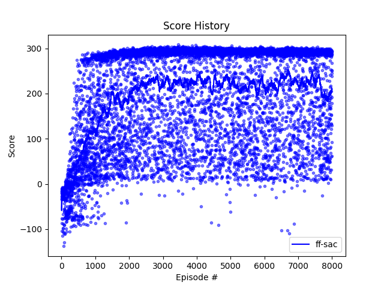

# Solving BipedalWalker-v3 and BipedalWalkerHardcore-v3 with Reinforcement Learning
This repository contains the code for solving the BipedalWalker-v3 and BipedalWalkerHardcore-v3 environment from OpenAI 
Gym. The vanilla DDPG fails to solve the problem. PPO solves the BipedalWalker-v3 environment Our most successful 
implementation is our TD3 algorithm. Also, we include a new algorithm which combines SAC and TD3. It shows a pretty 
good result, but need some improvement. The code is written in python.

## Setup

To run the code, all you need is to create a virtual environment and install the required packages. You can do this by running the following commands:

```bash
python3 -m venv <YOUR_VENV_NAME>
source <YOUR_VENV_NAME>/bin/activate
pip install -r requirements.txt
```
- You will need to change gym version for SAC directory only by running the following command:
```bash
pip uninstall gym
pip install gym==0.22
```

## Training
Each algorithm has slightly different training methods

- For DDPG and PPO
```bash
python3 train_<ALGORITHM_NAME>.py
```
- For TD3 and SAC(Combination of TD3 and SAC)
```bash
python train.py
python train_hardcore.py
```

## Results
The results of our TD3 implementation can be seen below:
- BipedalWalker-v3: 
- BipedalWalkerHardcore-v3: 

The results of our new approach of SAC implementation BipedalWalkerHardcore-v3 can be seen below:
- 
