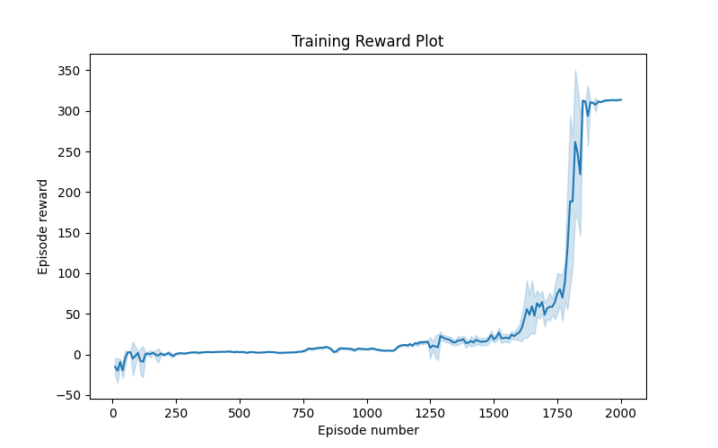
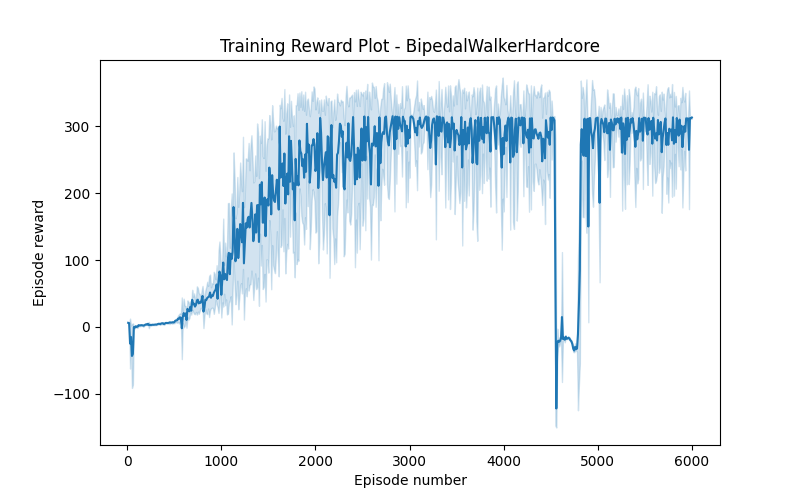

# Solving BipedalWalker-v3 and BipedalWalkerHardcore-v3 with Reinforcement Learning

This repository contains the code for solving the BipedalWalker-v3 environment from OpenAI Gym. Our most successful implementation is our TD3 algorithm. The code is written in python.

## Setup

To run the code, all you need is to create a virtual environment and install the required packages. You can do this by running the following commands:

```bash
python3 -m venv <YOUR_VENV_NAME>
source <YOUR_VENV_NAME>/bin/activate
pip install -r requirements.txt
```

## Training
Each algorithm has slightly different training methods, but they roughly conform to

```bash
python3 train_<ALGORITHM_NAME>.py
```

## Results
The results of our TD3 implementation can be seen below:
- BipedalWalker-v3: 

- BipedalWalkerHardcore-v3: 

